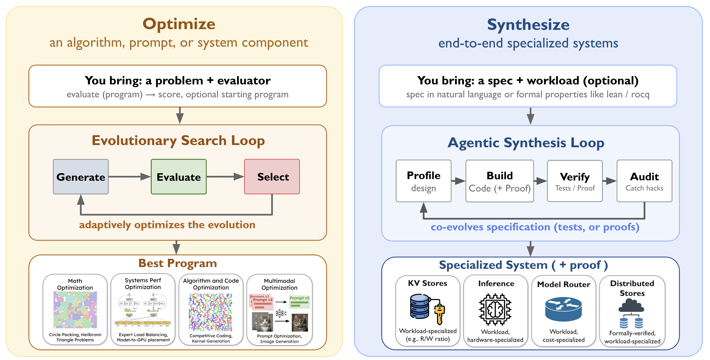

<h1 align="center">
  <picture>
    <source media="(prefers-color-scheme: dark)" srcset="assets/lockup-dark-bg.svg">
    <source media="(prefers-color-scheme: light)" srcset="assets/lockup-light-bg.svg">
    
  </picture>
</h1>

<p align="center">AI-driven scientific, algorithmic, and end-to-end systems discovery</p>

<div align="center">

[](https://skydiscover-ai.github.io/blogs.html)
[](docs/)
[![Slack](https://img.shields.io/badge/Slack-4A154B?logo=data%3Aimage/svg%2Bxml%3Bbase64%2CPHN2ZyB4bWxucz0iaHR0cDovL3d3dy53My5vcmcvMjAwMC9zdmciIHZpZXdCb3g9IjAgMCA0NDggNTEyIj48cGF0aCBmaWxsPSJ3aGl0ZSIgZD0iTTk0LjEyIDMxNS4xYzAgMjUuOS0yMS4xNiA0Ny4wNi00Ny4wNiA0Ny4wNlMwIDM0MSAwIDMxNS4xYzAtMjUuOSAyMS4xNi00Ny4wNiA0Ny4wNi00Ny4wNmg0Ny4wNnY0Ny4wNnptMjMuNzIgMGMwLTI1LjkgMjEuMTYtNDcuMDYgNDcuMDYtNDcuMDZzNDcuMDYgMjEuMTYgNDcuMDYgNDcuMDZ2MTE3Ljg0YzAgMjUuOS0yMS4xNiA0Ny4wNi00Ny4wNiA0Ny4wNnMtNDcuMDYtMjEuMTYtNDcuMDYtNDcuMDZWMzE1LjF6bTQ3LjA2LTE4OC45OGMtMjUuOSAwLTQ3LjA2LTIxLjE2LTQ3LjA2LTQ3LjA2UzEzOSAzMiAxNjQuOSAzMnM0Ny4wNiAyMS4xNiA0Ny4wNiA0Ny4wNnY0Ny4wNkgxNjQuOXptMCAyMy43MmMyNS45IDAgNDcuMDYgMjEuMTYgNDcuMDYgNDcuMDZzLTIxLjE2IDQ3LjA2LTQ3LjA2IDQ3LjA2SDQ3LjA2QzIxLjE2IDI0My45NiAwIDIyMi44IDAgMTk2LjlzMjEuMTYtNDcuMDYgNDcuMDYtNDcuMDZIMTY0Ljl6bTE4OC45OCA0Ny4wNmMwLTI1LjkgMjEuMTYtNDcuMDYgNDcuMDYtNDcuMDYgMjUuOSAwIDQ3LjA2IDIxLjE2IDQ3LjA2IDQ3LjA2cy0yMS4xNiA0Ny4wNi00Ny4wNiA0Ny4wNmgtNDcuMDZWMTk2Ljl6bS0yMy43MiAwYzAgMjUuOS0yMS4xNiA0Ny4wNi00Ny4wNiA0Ny4wNi0yNS45IDAtNDcuMDYtMjEuMTYtNDcuMDYtNDcuMDZWNzkuMDZjMC0yNS45IDIxLjE2LTQ3LjA2IDQ3LjA2LTQ3LjA2IDI1LjkgMCA0Ny4wNiAyMS4xNiA0Ny4wNiA0Ny4wNlYxOTYuOXpNMjgzLjEgMzg1Ljg4YzI1LjkgMCA0Ny4wNiAyMS4xNiA0Ny4wNiA0Ny4wNiAwIDI1LjktMjEuMTYgNDcuMDYtNDcuMDYgNDcuMDYtMjUuOSAwLTQ3LjA2LTIxLjE2LTQ3LjA2LTQ3LjA2di00Ny4wNmg0Ny4wNnptMC0yMy43MmMtMjUuOSAwLTQ3LjA2LTIxLjE2LTQ3LjA2LTQ3LjA2IDAtMjUuOSAyMS4xNi00Ny4wNiA0Ny4wNi00Ny4wNmgxMTcuODRjMjUuOSAwIDQ3LjA2IDIxLjE2IDQ3LjA2IDQ3LjA2IDAgMjUuOS0yMS4xNiA0Ny4wNi00Ny4wNiA0Ny4wNkgyODMuMXoiLz48L3N2Zz4%3D)](https://join.slack.com/t/skydiscover/shared_invite/zt-48y5bloat-iZCMDv98OQTo3TXX97s80g)
[](LICENSE)

</div>

SkyDiscover is an open-source framework from UC Berkeley that uses AI to discover better algorithms and build complete systems.

1. **Optimize**: improve an algorithm or a component of your system. You provide a way to score solutions, and evolutionary search finds programs that score better and better.
2. **Synthesize**: build an end-to-end system. You describe it in plain text or a formal spec, and coding agents build it specialized Just-in-Time for your workload, hardware, and requirements.

SkyDiscover works with Claude Code, Codex, Cursor, and Pi, and with any OpenAI-compatible model.

<p align="center">
  
</p>

## 📰 News

- **[2026/09]** 🎉 We released SkyDiscover-Synthesize (SkySynth), which lets you build trustworthy Just-in-Time systems specialized for your workload! [[Blog](https://skydiscover-ai.github.io/blog-skysynth.html)]
- **[2026/07]** 🎉 EvoX is accepted to COLM 2026!
- **[2026/05]** 🎉 We released two papers on synthesizing end-to-end systems that are correct by proof [[Paper](https://arxiv.org/abs/2605.23109)] or by test [[Paper](https://arxiv.org/abs/2605.24096)]!
- **[2026/03]** 🎉 SkyDiscover is accepted as an Industrial Spotlight paper at CAIS '26! [[Paper](https://doi.org/10.1145/3786335.3813221)]
- **[2026/02]** 🎉 We open-sourced SkyDiscover, along with our two adaptive optimization algorithms, AdaEvolve [[Paper](https://arxiv.org/abs/2602.20133)] and EvoX [[Paper](https://arxiv.org/abs/2602.23413)]!

## 📦 Installation

Requires Python 3.10 to 3.13 and [uv](https://docs.astral.sh/uv/).

```bash
git clone https://github.com/skydiscover-ai/skydiscover.git
cd skydiscover
uv sync
```

Optimize needs an LLM API key; Synthesize needs a coding agent (each set up in its section below).

More setup options are in the [installation guide](docs/content/docs/installation.mdx).

## 🧬 SkyDiscover-Optimize

SkyDiscover-Optimize evolves programs against your scoring function. Its two search algorithms, AdaEvolve and EvoX, achieve the strongest open-source results across ~200 benchmarks, and are used across industry including Google and Uber.

- **Frontier-CS (172 problems)**: ~34% higher median score than OpenEvolve, GEPA, and ShinkaEvolve under the same budget
- **Math + systems (14 tasks)**: matches or exceeds AlphaEvolve and human SOTA on 6/6 systems and 6/8 math tasks
- **Real-world systems**: 41% lower cross-cloud transfer cost, 14% better GPU load balance for MoE serving, 29% lower KV-cache pressure

### Quick start

Set the API key for your model provider, then evolve a program against your scoring function:

```bash
export OPENAI_API_KEY=<your-key>   # or ANTHROPIC_API_KEY / GEMINI_API_KEY
uv run skydiscover optimize evaluator.py --search adaevolve --model gpt-5 -i 100
# uv run skydiscover optimize evaluator.py --search evox --model gpt-5 -i 100
```

| Algorithm | Flag | Description |
|:---|:---|:---|
| ⭐&nbsp;**AdaEvolve** | `--search adaevolve` | Adaptive search that tunes its own settings as it runs |
| 🧠&nbsp;**EvoX** | `--search evox` | AI that optimizes its own optimization process |

The [full Optimize guide](skydiscover/optimize/README.md) covers six more algorithms, evaluator formats, the Python API, and complete benchmark results.

## 🏗️ SkyDiscover-Synthesize

SkyDiscover-Synthesize lets you build a system specialized for your own hardware, workload, and requirements, instead of adopting a one-size-fits-all one.

It has synthesized key-value stores up to 2.3x faster than Redis and FASTER (plus formally verified distributed ones), LLM inference engines with up to 2.2x the throughput of vLLM and SGLang, and model routers at up to 48% lower cost; each is a checked-in [example](skydiscover/synthesize/examples/README.md) you can run.

| Approach | Use it when | How it works |
|:---|:---|:---|
| [Formal-proof-driven](https://arxiv.org/abs/2605.23109) | You have a formal spec (e.g. Rocq) | Synthesizes the code and its machine-checked proof together, step by step |
| [Test-driven](https://arxiv.org/abs/2605.24096) | You have a plain-text description | Agents iterate on the implementation; an auditor turns every reward hack it finds (a change that raises the score while breaking what you meant) into a new test |

### Quick start

Install the `/skysynth` skill into the coding agent of your choice:

```bash
uv run skydiscover init   # wires every coding agent found on PATH; or --agent claude|cursor|codex|pi
```

Then prompt the agent:

```
/skysynth build me a fast in-memory key-value store
```

On Claude Code or Codex you can also install it as a plugin:

```bash
/plugin marketplace add skydiscover-ai/skydiscover   # Claude Code
/plugin install skysynth
codex plugin marketplace add skydiscover-ai/skydiscover   # Codex
codex plugin add skysynth
```

Your system lands in `outputs/synthesize/<slug>_<timestamp>/best/artifact/` (`<slug>` is a short name made from your prompt), with `spec.md` beside it saying what it guarantees and how it scored. The [full Synthesize guide](skydiscover/synthesize/README.md) covers how the agents work, both approaches, and adding a domain. The [tutorial](skydiscover/synthesize/examples/tutorial/) walks through a full synthesis; its notebook replays our run.

## 🤝 Contributing

Contributions are welcome! See [CONTRIBUTING.md](CONTRIBUTING.md) for development setup, testing, and pull request guidelines.

## ✍️ Citation

If you use SkyDiscover, please cite the framework paper:

```bibtex
@inproceedings{liu2026skydiscover,
  author    = {Liu, Shu and Cemri, Mert and Agarwal, Shubham and Krentsel, Alexander and Naren, Ashwin and Mang, Qiuyang and Li, Zhifei and Gupta, Akshat and Maheswaran, Monishwaran and Cheng, Audrey and Pan, Melissa and Boneh, Ethan and Ramchandran, Kannan and Sen, Koushik and Zaharia, Matei and Dimakis, Alexandros G. and Stoica, Ion},
  title     = {SkyDiscover: A Flexible, Adaptive Framework for AI-Driven Scientific and Algorithmic Discovery},
  booktitle = {Proceedings of the ACM Conference on AI and Agentic Systems},
  series    = {CAIS '26},
  year      = {2026},
  pages     = {1223--1227},
  publisher = {Association for Computing Machinery},
  doi       = {10.1145/3786335.3813221},
  url       = {https://doi.org/10.1145/3786335.3813221}
}
```

If you use SkyDiscover-Synthesize, please also cite:

```bibtex
@misc{liu2026skysynth,
  author       = {Shu Liu and Shubham Agarwal and Alexander Krentsel and Mert Cemri and Sidharth Sankhe and Ziming Mao and Alexandros G. Dimakis and Matei Zaharia and Ion Stoica},
  title        = {Building Specialized Systems that We Can Trust with Agents},
  year         = {2026},
  month        = sep,
  howpublished = {SkyDiscover Blog},
  url          = {https://skydiscover-ai.github.io/blog-skysynth.html}
}
```

<details>
<summary><b>Citations for the papers behind SkyDiscover-Optimize</b></summary>

If you use the **AdaEvolve** search algorithm:

```bibtex
@misc{cemri2026adaevolve,
  author        = {Mert Cemri and Shubham Agrawal and Akshat Gupta and Shu Liu and Audrey Cheng and Qiuyang Mang and Ashwin Naren and Lutfi Eren Erdogan and Koushik Sen and Matei Zaharia and Alex Dimakis and Ion Stoica},
  title         = {AdaEvolve: Adaptive LLM Driven Zeroth-Order Optimization},
  year          = {2026},
  eprint        = {2602.20133},
  archivePrefix = {arXiv},
  primaryClass  = {cs.NE},
  url           = {https://arxiv.org/abs/2602.20133}
}
```

If you use the **EvoX** search algorithm:

```bibtex
@misc{liu2026evox,
  author        = {Shu Liu and Shubham Agarwal and Monishwaran Maheswaran and Mert Cemri and Zhifei Li and Qiuyang Mang and Ashwin Naren and Ethan Boneh and Audrey Cheng and Melissa Z. Pan and Alexander Du and Kurt Keutzer and Alvin Cheung and Alexandros G. Dimakis and Koushik Sen and Matei Zaharia and Ion Stoica},
  title         = {EvoX: Meta-Evolution for Automated Discovery},
  year          = {2026},
  eprint        = {2602.23413},
  archivePrefix = {arXiv},
  primaryClass  = {cs.LG},
  url           = {https://arxiv.org/abs/2602.23413}
}
```

</details>

<details>
<summary><b>Citations for the papers behind SkyDiscover-Synthesize</b></summary>

If you use **formal-proof-driven synthesis** (Inductive Deductive Synthesis):

```bibtex
@misc{agarwal2026ids,
  author        = {Shubham Agarwal and Alexander Krentsel and Shu Liu and Mert Cemri and Audrey Cheng and Rui Meng and Tomas Pfister and Chun-Liang Li and Sylvia Ratnasamy and Aditya Parameswaran and Matei Zaharia and Ion Stoica and Mohsen Lesani},
  title         = {Inductive Deductive Synthesis: Enabling AI to Generate Formally Verified Systems},
  year          = {2026},
  eprint        = {2605.23109},
  archivePrefix = {arXiv},
  primaryClass  = {cs.AI},
  url           = {https://arxiv.org/abs/2605.23109}
}
```

If you use **test-driven synthesis** (Just-in-Time Systems):

```bibtex
@misc{liu2026jitsystems,
  author        = {Shu Liu and Alexander Krentsel and Shubham Agarwal and Mert Cemri and Ziming Mao and Soujanya Ponnapalli and Alexandros G. Dimakis and Sylvia Ratnasamy and Matei Zaharia and Aditya Parameswaran and Ion Stoica},
  title         = {The Time is Here for Just-in-Time Systems: Challenges and Opportunities},
  year          = {2026},
  eprint        = {2605.24096},
  archivePrefix = {arXiv},
  primaryClass  = {cs.DB},
  url           = {https://arxiv.org/abs/2605.24096}
}
```

</details>

## 📬 Contact Us

Join our [Slack community](https://join.slack.com/t/skydiscover/shared_invite/zt-48y5bloat-iZCMDv98OQTo3TXX97s80g) for questions and discussion, or reach out to us directly:
[lshu@berkeley.edu](mailto:lshu@berkeley.edu) · [akrentsel@berkeley.edu](mailto:akrentsel@berkeley.edu) · [mert_cemri@berkeley.edu](mailto:mert_cemri@berkeley.edu) · [shubham3@berkeley.edu](mailto:shubham3@berkeley.edu) · [sidharth_sankhe@berkeley.edu](mailto:sidharth_sankhe@berkeley.edu)

## Local integrations

The [consumer assist bridge](docs/consumer-assist-bridge.md) runs consumer evaluators in their own Python environment. The authenticated local Codex provider uses `codex-cli/gpt-5.6-sol`; see [its configuration](skydiscover/optimize/configs/codex_cli.yaml). Local commands `skydiscover-run`, `skydiscover-viewer`, `skydiscover-assist`, and `skydiscover-remote-bootstrap` remain available.
