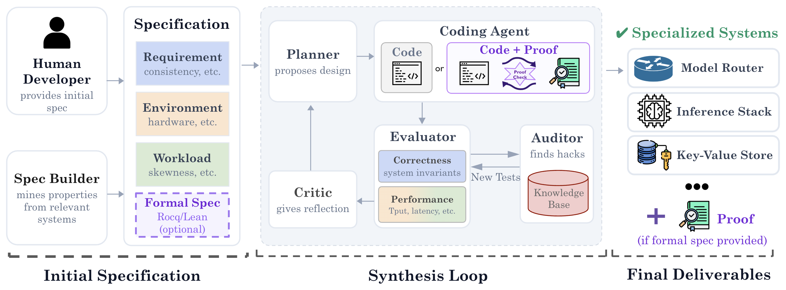

# SkyDiscover-Synthesize

<p align="center">
  
</p>

**Describe the system you need, in plain text or a formal spec, and a team of agents builds it
[Just-in-Time](https://arxiv.org/abs/2605.24096) for your workload, hardware, and constraints.** The hard part is trust: agents
reward hack, so the specification co-evolves with the implementation, as tests when the
requirements cannot be formalized and as machine-checked proofs when they can.

## 🚀 Quick Start

```bash
uv run skydiscover init   # wires every coding agent found on PATH; or --agent claude|cursor|codex|pi
```

Restart your coding agent, then:

```
/skysynth build me a fast in-memory key-value store
```

Your system lands in `outputs/synthesize/<slug>_<timestamp>/best/artifact/`. Beside it, `spec.md`
says what it guarantees and how it scored, `tests/` holds the tests it passes, and `checkpoints/`
every scored iteration.

What the run learned about this kind of system is kept in `~/.skydiscover/<domain>/` for the next
run. Tests are written in whatever language suits the system; proofs in Rocq or Lean.

| Start here | What you get |
|:---|:---|
| [Tutorial](examples/tutorial/README.md) | A real run, step by step: one prompt and one workload file in, a cache 2.4x better than FIFO and LRU out |
| [Examples](examples/README.md) | Four systems with their exact `/skysynth` prompts: a key-value store, a formally verified distributed store, a model router, and an inference engine |

## ⚙️ How It Works

The Spec Builder turns your prompt, plus what it learns from real systems of the same kind, into a
specification: requirements, environment, workload, and optionally a formal spec.

Then the loop runs: the Planner proposes a design, the Coding Agent implements it, the Evaluator
scores it, and the Critic guides the next round.

Every specification misses something, so the Auditor looks for reward hacks (changes that raise the
score while breaking what you meant) and turns each one into a new test. Those tests, and your
answers, are kept in `~/.skydiscover/<domain>/` for the next run.

| Approach | Use it when | How correctness is checked |
|:---|:---|:---|
| [Test-driven](https://arxiv.org/abs/2605.24096) | You have a plain-text description | Tests that grow with the implementation; the Auditor adds one for every reward hack it finds |
| [Formal-proof-driven](https://arxiv.org/abs/2605.23109) | You have a formal spec (e.g. Rocq) | A machine-checked proof, built step by step with the code ([Inductive Deductive Synthesis](https://arxiv.org/abs/2605.23109)) |

The result comes with `spec.md`: the properties it satisfies, what was measured, and how each checkpoint fared.

## 🤖 Supported Coding Agents

SkySynth runs on Claude Code, Cursor, Codex, and pi. `skydiscover init` wires it into your project
for every one of them it finds on PATH (`--agent <name>` picks one). Claude Code and Codex can also
install it as a self-updating plugin:

```bash
# Claude Code
/plugin marketplace add skydiscover-ai/skydiscover
/plugin install skysynth

# Codex
codex plugin marketplace add skydiscover-ai/skydiscover
codex plugin add skysynth
```

Either way, invoke it as `/skysynth <what to build>`.

<details>
<summary><b>Plugin notes and file layout</b></summary>

- The plugin does not install the `skydiscover` Python package; you still need
  `uv pip install git+https://github.com/skydiscover-ai/skydiscover` (or a source checkout) for the tooling.
- Claude plugins cannot set env vars. The optional agent-teams mode needs
  `CLAUDE_CODE_EXPERIMENTAL_AGENT_TEAMS=1` in your settings; without it, roles run as regular
  subagents.
- Codex plugins cannot ship the agent roles yet. Also run `skydiscover init --agent codex` to
  add them; without them the roles run one at a time in the main session.
- `marketplace add` reads a one-entry catalog from the repository root: Claude Code from
  [`.claude-plugin/marketplace.json`](../../.claude-plugin/marketplace.json), Codex from
  [`.agents/plugins/marketplace.json`](../../.agents/plugins/marketplace.json). Each tool fixes
  its own path and format, which is why the root has both.

All agents share the same `workflow/` directory and role instruction files (briefs); only the paths differ. The installer
is [`scripts/install.sh`](scripts/install.sh).

| Agent | Skill | Roles | Hooks |
|---|---|---|---|
| claude | `.claude/skills/skysynth` | `.claude/agents/*.md` | `.claude/settings.local.json` |
| cursor | `.cursor/skills/skysynth` | `.cursor/agents/*.md` | `.cursor/hooks.json` (clone-reuse guard only; deliveries are checked at run finish) |
| codex | `.agents/skills/skysynth` | `.codex/agents/*.toml` | `.codex/hooks.json` |
| pi | `.agents/skills/skysynth` | `.pi/agents/*.md` | `.pi/extensions/skydiscover-hooks.ts` |
</details>

<details>
<summary><b>Codex and pi setup</b></summary>

**Codex.** Roles are generated as TOML from the shared briefs; edit a brief and re-run the
installer rather than editing a TOML. Then:

1. Trust the project so Codex reads `.codex/`: approve on first launch, or set
   `trust_level = "trusted"` under `[projects."/abs/path"]` in `~/.codex/config.toml`. Untrusted,
   Codex silently falls back to generic agents.
2. Run with `--sandbox workspace-write`; the default read-only policy blocks compile and benchmark
   steps.
3. Run `/hooks` once inside Codex to trust the hooks.

On Ubuntu 24.04+ the sandbox also needs a bubblewrap profile, or shell commands fail with
`bwrap: setting up uid map: Permission denied`:

```bash
sudo apt-get install -y bubblewrap
sudo tee /etc/apparmor.d/bwrap >/dev/null <<'EOF'
abi <abi/4.0>,
include <tunables/global>
profile bwrap /usr/bin/bwrap flags=(unconfined) {
  userns,
  include if exists <local/bwrap>
}
EOF
sudo apparmor_parser -r /etc/apparmor.d/bwrap
```

For scripting, `codex exec` blocks on stdin (redirect `< /dev/null`), and persist the API key with
`printenv OPENAI_API_KEY | codex login --with-api-key` (a bare env var returns 401).

**pi.** pi has no `hooks.json`, so the hooks run through `.pi/extensions/skydiscover-hooks.ts`.
Trust the project on first launch so pi loads `.pi/` and `.agents/skills/`. Optionally wire a
subagent tool for running roles as subagents (pi ships one at `examples/extensions/subagent` in its own repo);
everything works with or without it.
</details>

## 🗂️ Repository Layout

| Path | What it is |
|:---|:---|
| [`workflow/`](workflow/) | The `/skysynth` skill: agent instructions, test and proof scripts, the delivery hook, and the plugin manifests; [`adapters/`](workflow/adapters/README.md) has the per-agent wiring |
| [`spec/`](spec/README.md) | Specification tooling: requirements, decisions, checkpoints, and what is kept across runs |
| [`examples/`](examples/README.md) | The tutorial and four systems you can build |
| [`scripts/`](scripts/) | The installer `skydiscover init` runs |
| [`../../.claude-plugin/`](../../.claude-plugin/), [`../../.agents/plugins/`](../../.agents/plugins/) | The catalogs `marketplace add` reads from the repository root, one for Claude Code and one for Codex; each tool fixes its own path |

## 🧩 Adding a Domain

Write a `task.md` describing the system, how it is scored, and its interface; that is the only file
the agents need. Optionally check in your benchmark, a correct reference implementation, or a formal
spec so every run starts from the same tests. Steps are in
[Adding a domain](examples/README.md#adding-a-domain).

## ✍️ Citation

If you use SkyDiscover-Synthesize, please cite:

```bibtex
@misc{liu2026skysynth,
  author       = {Shu Liu and Shubham Agarwal and Alexander Krentsel and Mert Cemri and Sidharth Sankhe and Ziming Mao and Alexandros G. Dimakis and Matei Zaharia and Ion Stoica},
  title        = {Building Specialized Systems that We Can Trust with Agents},
  year         = {2026},
  month        = sep,
  howpublished = {SkyDiscover Blog},
  url          = {https://skydiscover-ai.github.io/blog-skysynth.html}
}
```

<details>
<summary><b>Citations for the underlying papers: Inductive Deductive Synthesis and Just-in-Time Systems</b></summary>

If you use **formal-proof-driven synthesis** (Inductive Deductive Synthesis):

```bibtex
@misc{agarwal2026ids,
  author        = {Shubham Agarwal and Alexander Krentsel and Shu Liu and Mert Cemri and Audrey Cheng and Rui Meng and Tomas Pfister and Chun-Liang Li and Sylvia Ratnasamy and Aditya Parameswaran and Matei Zaharia and Ion Stoica and Mohsen Lesani},
  title         = {Inductive Deductive Synthesis: Enabling AI to Generate Formally Verified Systems},
  year          = {2026},
  eprint        = {2605.23109},
  archivePrefix = {arXiv},
  primaryClass  = {cs.AI},
  url           = {https://arxiv.org/abs/2605.23109}
}
```

If you use **test-driven synthesis** (Just-in-Time Systems):

```bibtex
@misc{liu2026jitsystems,
  author        = {Shu Liu and Alexander Krentsel and Shubham Agarwal and Mert Cemri and Ziming Mao and Soujanya Ponnapalli and Alexandros G. Dimakis and Sylvia Ratnasamy and Matei Zaharia and Aditya Parameswaran and Ion Stoica},
  title         = {The Time is Here for Just-in-Time Systems: Challenges and Opportunities},
  year          = {2026},
  eprint        = {2605.24096},
  archivePrefix = {arXiv},
  primaryClass  = {cs.DB},
  url           = {https://arxiv.org/abs/2605.24096}
}
```

</details>
