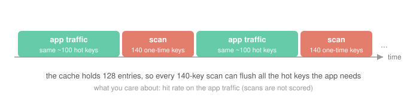

# Tutorial: Build a Cache for Your Workload

To demonstrate SkyDiscover-Synthesize's ability to generate **trustworthy, high-performance systems specialized Just-in-Time for a custom workload**, we will build a custom cache starting from a known workload and a one-sentence description of the goals of the system. SkyDiscover-Synthesize will measure the problem, ask questions, and then design, build, benchmark, and audit a cache for exactly that workload.

Total time: ~5 minutes for setup, followed by 2-3 hours of background runtime. 

You can skip to the demo section to see the log from a successful run.

## The problem

An application keeps re-reading the same ~100 hot keys, but every 120 operations a batch job scans through 140 one-time keys it will never touch again — and the cache in between holds only 128 entries, so a single scan can flush the entire hot set. Generic eviction policies cannot cope: FIFO and LRU both drop to a 0.39 hit rate on this trace, refetching the app's own data after every scan. The goal is a cache built for exactly this traffic — one that keeps the hot keys resident through the scans — scored on the one number the app cares about: how often it finds its data already in the cache.



## Step 0: Setup

The tutorial is shown with Claude Code on Linux or macOS; Cursor, Codex, and pi run the same skill (`skydiscover init --agent <name>`). You need three things installed:

1. **Python 3.10 to 3.13 and [uv](https://docs.astral.sh/uv/)** — the agents run the `skydiscover` Python package's scripts through it.
2. **[Claude Code](https://docs.anthropic.com/en/docs/claude-code)**, logged in: `npm install -g @anthropic-ai/claude-code`, then run `claude` once.
3. **This repository**, cloned somewhere it can stay (the installer symlinks into it), with the package installed:

   ```bash
   git clone https://github.com/skydiscover-ai/skydiscover.git
   cd skydiscover
   uv sync                     # install the skydiscover package and its dependencies
   source .venv/bin/activate   # put python and skydiscover on PATH for this shell
   ```

   The one requirement from here on: the shell you start Claude Code from must pass `python3 -c 'import skydiscover'`. The activated venv does that; in a new terminal, re-run `source <path-to-skydiscover>/.venv/bin/activate` first.

## Step 1: Setting up the problem directory

SkySynth builds against a **measurable definition of good**, so a problem is two things: a project directory, and a file in it that anyone (you or the agents) can run to score a candidate (one built version of the system).

We provide a workload file for our demo problem of a workload with a unique read/write pattern for a cache. Make the directory and drop the workload in:

```bash
mkdir my-cache && cd my-cache
cp <path-to-skydiscover>/skydiscover/synthesize/examples/tutorial/workload.py .
cp <path-to-skydiscover>/skydiscover/synthesize/examples/tutorial/play.py .  # loads candidates and results (Step 4); also the scripted demo (Step 5)
```

[`workload.py`](workload.py) is the whole problem in one small file: a trace (an app hammering ~100 hot keys, interrupted every 120 operations by a batch scan of 140 one-time keys, through a 128-entry cache) and a `replay(create_cache)` scorer that returns the app-traffic hit rate. Run it to see the bar you are trying to beat:

```bash
python workload.py
# FIFO baseline: {'app_hit_rate': 0.39, ...}
```

> **For your own problem:** the trace here is generated by a seeded function so the tutorial stays self-contained, but `replay()` also accepts a `key,kind` CSV exported from your own system (`replay(create_cache, trace="my_trace.csv")`; run `python workload.py --export trace.csv` to see the shape). The transferable step is: put a script in the directory that replays *your* data and prints a score. That scorer is what keeps the result honest — the agents optimize against it, and you can re-run it yourself at any time.

Now set up `/skysynth` in this directory (once; running it again is harmless):

```bash
skydiscover init --agent claude
```

This symlinks the `/skysynth` skill and its agent roles (Spec Builder, Planner, Coding Agent, Evaluator, Critic, Auditor) into `.claude/` here, and writes `.claude/settings.local.json` (the hook that runs the tests before anything is delivered). If Claude Code is already running in this directory, restart it so it picks the settings up.

## Step 2: Kick off the run

Start Claude Code in the directory and send the prompt: one sentence saying what you want. We recommend running the tutorial on **Claude Sonnet 5** (`--model claude-sonnet-5`): the build loop makes many agent calls over a few hours, and Sonnet 5 handles it well at a fraction of the cost of Opus. The agents compile, benchmark, and run candidates, so grant tool permissions as you are comfortable; the scripted demo and notebook run with `--dangerously-skip-permissions` inside a sandbox for exactly this reason.

```bash
claude --model claude-sonnet-5 --dangerously-skip-permissions
```

```
/skysynth Build me a fast cache for the workload in workload.py. Ask me what you need to know before starting.
```

(The run asks its questions anyway; the last sentence only makes that explicit.) The agents' first move is not to write code: they measure your workload, run the generic baselines, and study real systems in the domain (for caches: W-TinyLFU, ARC, S3-FIFO, SIEVE). This first turn takes a few minutes.

## Step 3: Answer its questions

Instead of guessing at what you meant, the agents come back with the few decisions only you can make — usually three or four. The exact questions (and how many) vary run to run; ours asked:

- does "fast" include per-operation cost, or is hit rate the only score?
- may the cache remember keys it has already evicted (none / bounded / unbounded memory)?
- how long should it search? **Quick** (≈20 iterations) / **Standard** (≈60) / **Thorough** (≈200)

Each question comes with a sensible default, so a complete answer can be one line — ours was:

```
1b, 2b, Quick. Go ahead.
```

Your answers are pinned into a spec on disk, and everything built from here is held to it. 

You can inspect the evolving spec yourself as the long-running portion kicks off:

```bash
cat .skydiscover/*/specification/spec.json | python3 -m json.tool | head -30
```

For this run the title was `Scan-resistant fixed-capacity in-memory keyed cache` and the pinned interface is exactly the one `replay()` calls: `create_cache(capacity)`, `get(key)`, `put(key, value)`, `size()`.

## Step 4: Let it run, then verify the result yourself

From here it is hands-off: the agents design, build, benchmark, audit for reward hacks (changes that raise the score while breaking a property), and repeat. A Quick run takes a few hours — leave it going and check in. While it runs you can score the candidate the team is working on right now with your own scorer. `current_candidate()` finds it the way the test harness does (the file or package the agents last scored), and `load_candidate()` imports it the way the tests do:

```python
from play import current_candidate, load_candidate
from workload import replay

found = current_candidate()                 # None until the first candidate exists
if found:
    run, entry = found
    candidate = load_candidate(entry, run.interface)
    print(entry.relative_to(run.path), replay(candidate.create_cache))
```

When the run finishes, the result lands in `outputs/synthesize/<slug>_<timestamp>/best/` (`<slug>` is a short name made from your prompt): `spec.md` (what was asked, what was decided, and the test that checks each answer), the cache itself (`artifact/`), the tests it passes (`tests/`), and its score with the baseline it was measured against (`score.json`). Do not take the score's word for the headline number; measure it:

```python
from play import delivered, load_winner
from workload import replay

finished = delivered()  # final tests passed, not just a saved candidate
if not finished:
    raise RuntimeError("No verified result yet; check the run status.")
create_cache = load_winner(finished[-1])

print(replay(create_cache))             # the trace it was built against
print(replay(create_cache, seed=123))   # a fresh trace it has never seen
```

The second score checks one fresh trace; it does not establish correctness on every workload. Our reference numbers are in [Results](#results) below.

## Results

Results can differ per-run, as SkyDiscover-Synthesize relies on an LLM to drive the design exploration loop, which results in different designs between runs. However, we report the results from our run of this tutorial here:

| policy | application hit rate |
|---|---|
| FIFO | 0.39 |
| LRU | 0.39 (bit-identical to FIFO on this trace) |
| **synthesized for this workload** | **0.94** |
| Belady/OPT ceiling | 0.955 |

We see the final design at 2.4x over the generic policies, at 98.5% of what an oracle that knows the future could do, and it holds up on fresh traces it never saw during the build.

## Running on your own workload

Nothing above was cache-specific except the contents of one file and one sentence. The recipe is:

1. Make a project directory and run `skydiscover init --agent claude` in it.
2. Put a workload file in it: your own trace data plus a scorer anyone can run.
3. In Claude Code (`claude --model claude-sonnet-5` recommended): `/skysynth <one sentence>`.
4. Answer the questions; skim the spec it pins.
5. Let it run, then re-score the result with your own scorer, including on data it never saw.


## Demo

This path runs the same scenario as the tutorial above, but fully guided in a custom demo TUI, and will produce the final synthesized system as an artifact for you to inspect. The agents' clarifying questions are answered automatically with their suggested defaults, and every step the agents take lands in a scrollable log pane inside the TUI (arrow keys page back to the start of the run while it keeps working; the same log is mirrored to play.log). It runs on Claude Sonnet 5 (the model we recommend for the tutorial) and needs a few Enter presses in the first minutes to step through the intro, then runs hands-off for a few hours; leave it going and check in.

<details>
  <summary>To view the output from a reference run (instantly, without spending tokens), open the reference Jupyter notebook:</summary>

[`tutorial.ipynb`](tutorial.ipynb) drives the same session cell by cell, with the outputs of our run stored in it: the one-sentence prompt, the questions the agents ask back, the build loop, and the final comparison.

To start it:
```bash
uv run skydiscover init --agent claude --path skydiscover/synthesize/examples/tutorial
uv run --with jupyter --with matplotlib jupyter lab skydiscover/synthesize/examples/tutorial/tutorial.ipynb
```
</details>

You need: Python 3.10 to 3.13 and [uv](https://docs.astral.sh/uv/); [Claude Code](https://docs.anthropic.com/en/docs/claude-code) installed and logged in; and the package installed once with `uv sync` from the repo root (see Step 0).

To run the guided demo, open a terminal at the repo root and run it through `uv` so the agents can import `skydiscover`:

```bash
uv run python skydiscover/synthesize/examples/tutorial/play.py
```
